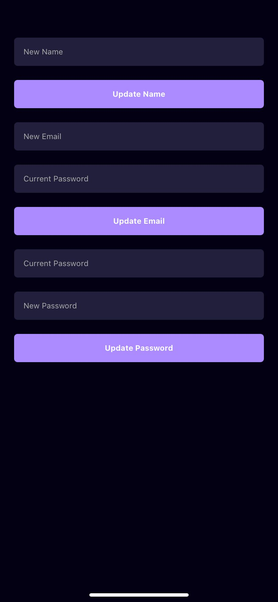

# 🎬 MovieApp – React Native Film Keşif Uygulaması

MovieApp, React Native ve TypeScript kullanılarak geliştirilen, TMDB API ile çalışan modern bir film keşif uygulamasıdır.  
Kullanıcılar popüler filmleri listeleyebilir, detaylarına göz atabilir, arama yapabilir ve favori listesi oluşturabilir.

---

## ✨ Özellikler

- 🔍 Popüler filmleri listeleme (TMDB API'den)
- 📄 Film detaylarını görüntüleme (özet, afiş, puan)
- 🔎 Film ismine göre arama
- ⭐ Favorilere film ekleme ve çıkarma
- 👤 Profil ekranı
- ⚙️ Profil bilgilerini güncelleme
- 🔐 Giriş ekranı (mock login)
- 🎨 Modern mobil tasarım (NativeWind / Tailwind)
- ☁️ `.env` üzerinden API key yönetimi
- ⚙️ FlatList ile yüksek performanslı listeleme
- 📦 Tam TypeScript desteği

---

## 🖼️ Ekran Görüntüleri

### 🏠 Ana Sayfa
Kullanıcıyı karşılayan ekran, en popüler filmleri gösterir.  


---

### 📄 Film Detay Sayfası
Seçilen filmin açıklaması, afişi, puanı ve yayın tarihi gibi bilgiler yer alır.  


---

### 🔍 Arama (Search) Sayfası
Kullanıcı film ismine göre arama yapabilir.  


---

### ⭐ Favoriler Sayfası
Beğenilen filmler favorilere eklenip buradan görüntülenebilir.  


---

### 👤 Profil Ekranı
Kullanıcının genel bilgileri ve hesap erişimi burada yer alır.  


---

### 🔐 Giriş Ekranı
Kullanıcı giriş formu, e-posta ve şifre doğrulaması içerir.  


---

### ⚙️ Profil Ayarları
Kullanıcı bilgilerini güncelleme, çıkış yapma gibi işlemler bu ekrandan yapılabilir.  



## ⚙️ Kurulum

```bash
# 1. Repoyu klonla
git clone https://github.com/GoktugGok/MovieApp-React-Native.git
cd MovieApp-React-Native

# 2. Gerekli paketleri yükle
npm install

# 3. .env dosyası oluştur (TMDB API key gir)
# .env dosyasına şunu yaz:
TMDB_API_KEY=your_tmdb_api_key_here

# 4. Uygulamayı başlat
npx expo start
