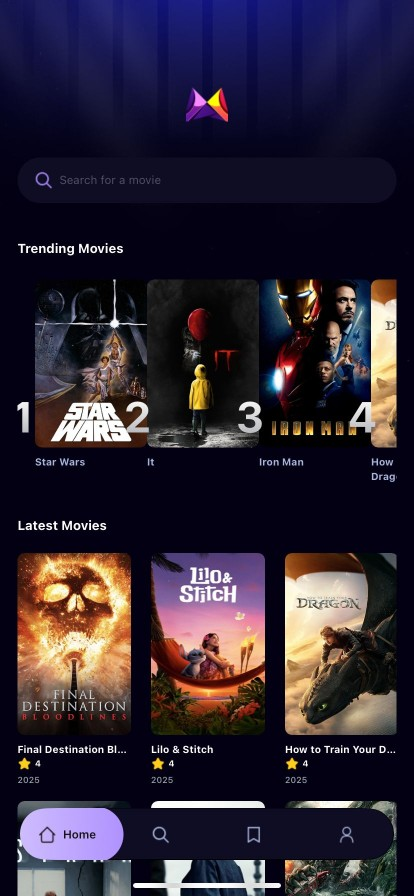

# 🎬 MovieApp – React Native Movie Discovery App

MovieApp is a modern movie discovery application developed using React Native and TypeScript, powered by the TMDB API.
Users can browse popular movies, view details, search for films, and create favorite lists.

---

## ✨ Özellikler

- 🔍 Browse popular movies (from TMDB API)
- 📄 View movie details (summary, poster, rating)
- 🔎 Search movies by title
- ⭐ Add/remove movies from favorites
- 👤 Profile screen
- ⚙️ Update profile information
- 🔐 Login screen (mock login)
- 🎨 Modern mobile design (NativeWind / Tailwind)
- ☁️ API key management via .env
- ⚙️ High-performance listing with FlatList
- 📦 Full TypeScript support

---

## 🖼️ Screenshots

### 🏠 Home Screen
Welcomes the user and displays the most popular movies.



---

### 📄 Movie Detail Screen
Shows selected movie's description, poster, rating, release date, and other information.


---

### 🔍 Search Screen
Users can search for movies by title.


---

### ⭐ Favorites Screen
Liked movies are added to favorites and can be viewed here.


---

### 👤 Profile Screen
Displays user's general information and account access. 


---

### 🔐 Login Screen
User login form with email and password validation.


---

### ⚙️ Profile Settings Screen
Users can update their information and log out from this screen. 


## ⚙️ Installation

```bash
# 1. Clone the repository
git clone https://github.com/GoktugGok/MovieApp-React-Native.git
cd MovieApp-React-Native

# 2. Install required packages
npm install

# 3. Create .env file (enter your TMDB API key)
# .env dosyasına şunu yaz:
TMDB_API_KEY=your_tmdb_api_key_here

# 4. Start the application
npx expo start
