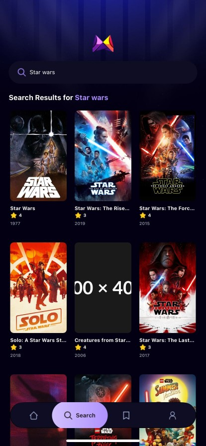
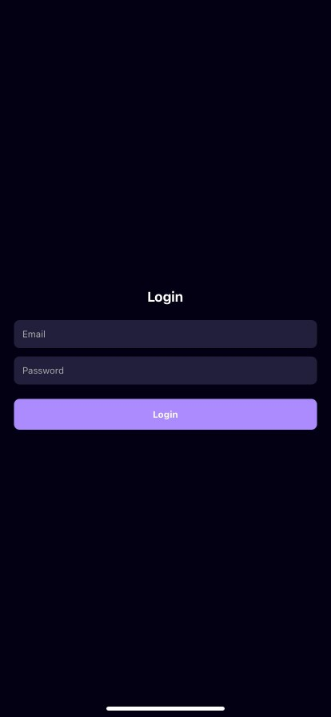

# 🎬 Movie App

Mobil uygulamanla sinema dünyası parmaklarının ucunda! Bu uygulamayla film detaylarını görüntüleyebilir, favorilerine ekleyebilir ve harika bir kullanıcı deneyimi yaşayabilirsin.

## 🚀 Özellikler

- 🔍 Film arama
- 🎥 Detaylı film bilgileri
- ❤️ Favorilere ekleme / çıkarma
- 🔐 Kullanıcı girişi ve kaydı
- 📂 Kaydedilen filmleri görüntüleme

## 📸 Ekran Görüntüleri

| Ana Sayfa | Film Detayı | Search Sayfası | favoriler Sayfası |
|-----------|-------------|----------------|-------------|
:--:|:--:
 |  |  |  

Profile Ekranı | Giriş Ekranı | Favoriler
:--:|:--:
 |  | 

## 📱 Teknolojiler

- React Native  
- Expo  
- Appwrite  
- TMDB API

## 📦 Kurulum

```bash
git clone https://github.com/kullanici-adi/movie-app.git
cd movie-app
npm install
npm start
